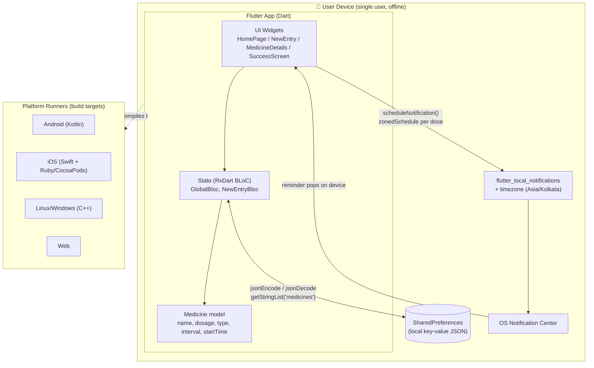

# As-Is Architecture — Original Flutter App

The original **Mediminder** is a single-user, offline mobile app. There is no
backend, no database, and no authentication. Medicines are stored on-device
via `SharedPreferences`, and reminders fire as **on-device local
notifications**. The "C++/Ruby" in the stack comes from Flutter's platform
runners (Linux/Windows desktop = C++, iOS CocoaPods = Ruby).



## Characteristics
- **Persistence:** local only (`SharedPreferences`) — data does not leave the device.
- **Users:** exactly one implicit user; no login.
- **Notifications:** OS-level local notifications scheduled from the device.
- **Scheduling logic:** given a `startTime` and `interval` (6/8/12/24h), it fires
  `24 / interval` reminders per day (`lib/src/ui/new_entry/new_entry.dart`).
- **Limitations that motivate the rewrite:** no multi-user, no central data, no
  analytics, no web access, tightly coupled to mobile OS notification APIs.
```
