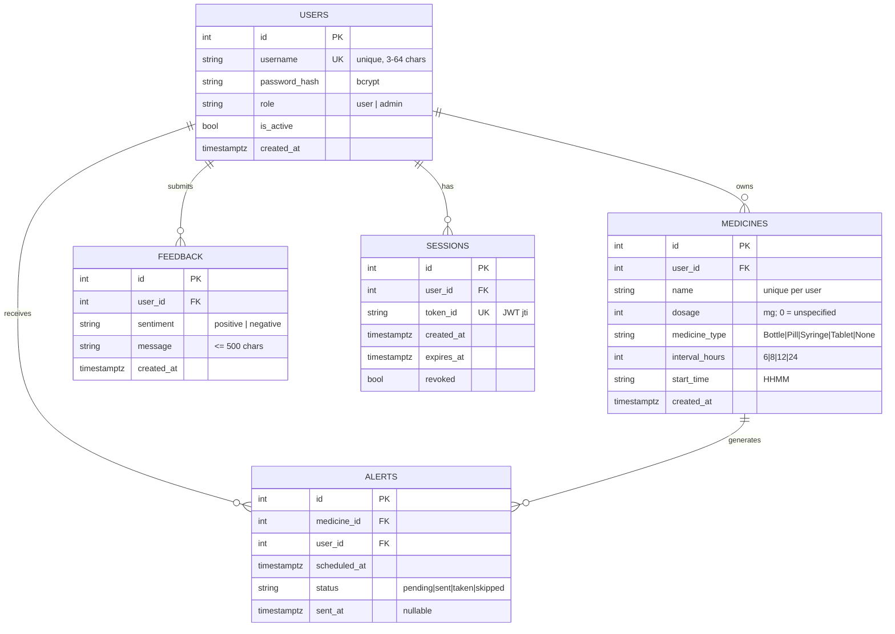

# Entity Relationship Diagram



## Notes
- **`MEDICINES.name` is unique per user** (`uq_user_medicine_name`), preserving
  the original app's duplicate-name rule.
- **`ALERTS`** materializes each dose reminder so the browser can poll due ones
  and the admin dashboard can count sent / upcoming alerts.
- **`SESSIONS`** holds one row per login (`token_id` = JWT `jti`); multiple rows
  per user provide **multi-session** support, and `revoked` enables logout.
- All FKs cascade on user/medicine delete.
```
