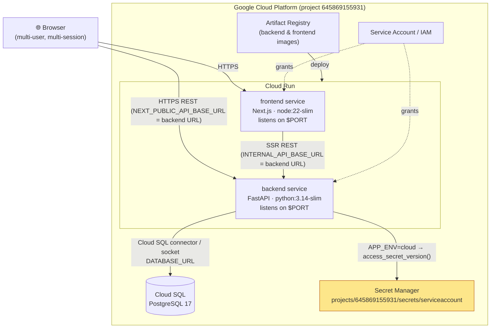

# New Architecture — Cloud Execution (Google Cloud Platform)

The **same container images** run on Cloud Run; PostgreSQL is provided by Cloud
SQL; secrets come from Secret Manager. Deployment/testing is **out of scope** —
this documents the target topology the code is built for.



## Local ↔ Cloud parity (single codebase)
| Concern | Local | Cloud |
|---------|-------|-------|
| Compute | Docker Compose services | Cloud Run services |
| Database | `postgres:17` container | Cloud SQL for PostgreSQL |
| `DATABASE_URL` | compose `db` host | Cloud SQL connection string |
| Secrets | `.env` (gitignored) | **Secret Manager** `projects/645869155931/secrets/serviceaccount` |
| Port | fixed 8000 / 3000 | `$PORT` injected by Cloud Run (Dockerfiles honor it) |
| Switch | `APP_ENV=local` | `APP_ENV=cloud` |

The **only** behavioural branch is `APP_ENV`: when `cloud`, `config.py` calls
`secrets_provider.load_jwt_secret()` to fetch the secret from Secret Manager;
otherwise secrets come from the environment. Everything else — code, images,
schema, API — is identical.

## Suggested deploy outline (not executed here)
1. `gcloud builds submit` / `docker push` both images to Artifact Registry.
2. Create Cloud SQL Postgres instance + database; grant the runtime service
   account the Cloud SQL Client role.
3. Store the secret in Secret Manager; grant `secretAccessor` to the service account.
4. `gcloud run deploy backend` with `APP_ENV=cloud`, `DATABASE_URL`, Cloud SQL
   connection, and the secret bound.
5. `gcloud run deploy frontend` with `NEXT_PUBLIC_API_BASE_URL` = backend URL.
```
