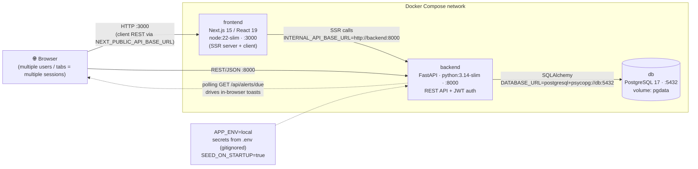

# New Architecture — Local Execution (Docker Compose)

Three containers on one Docker network, started with `docker compose up`. The
same images are what deploy to the cloud, so behaviour is consistent.



## Flow
1. `docker compose up --build` starts **db**, then **backend** (waits for DB
   healthcheck), then **frontend**.
2. On startup the backend creates tables (`init_db`) and loads **synthetic seed
   data** (idempotent).
3. The browser loads the Next.js UI; client components call the backend REST API
   directly; server components can call it over the internal network.
4. Reminders are surfaced by the client **polling** `/api/alerts/due` every ~15s
   and rendering toasts — no email/SMS.

## Environment variables (local)
| Var | Value | Purpose |
|-----|-------|---------|
| `APP_ENV` | `local` | Skip Secret Manager; use env secrets |
| `DATABASE_URL` | `...@db:5432/mediminder` | Points at compose Postgres |
| `JWT_SECRET` | dev placeholder | JWT signing |
| `NEXT_PUBLIC_API_BASE_URL` | `http://localhost:8000` | Browser → backend |
| `INTERNAL_API_BASE_URL` | `http://backend:8000` | SSR → backend |
```
