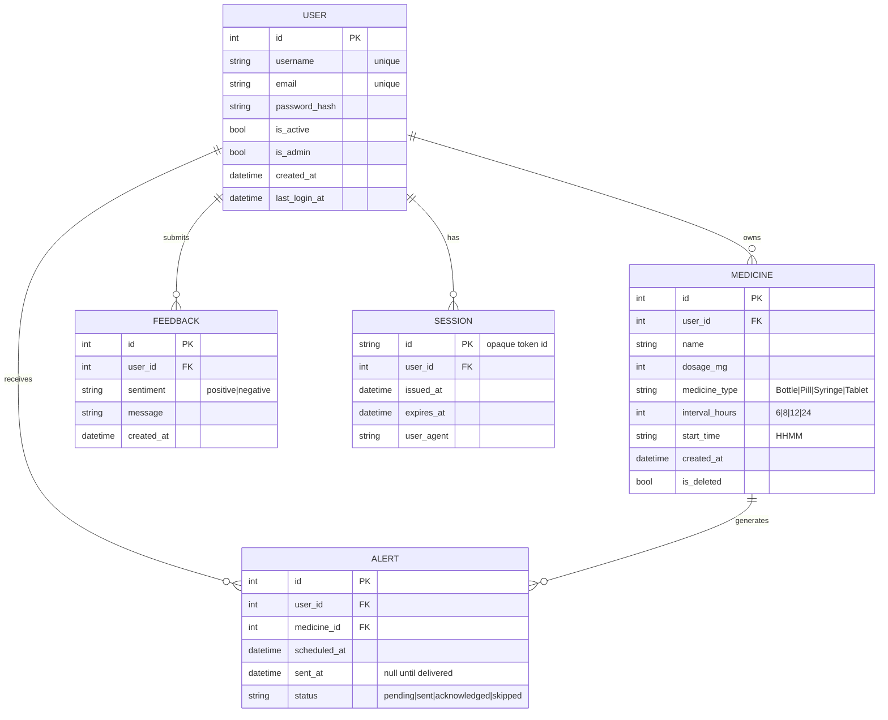

# Entity Relationship Diagram

## Textual view

- **USER** — application accounts. `is_admin=true` unlocks the admin dashboard;
  `is_active` drives the active/inactive pie chart. One user, many devices —
  the `SESSION` table lets us support multi-session login (a JWT `jti` claim
  maps to a `SESSION.id`).
- **MEDICINE** — replaces the on-device JSON blob from the Flutter app.
  Preserves the original four medicine types, dosage in mg, hour-interval,
  and 4-char `HHMM` start time.
- **ALERT** — materialized notification events. APScheduler pre-computes the
  next N alerts per medicine so the admin dashboard can answer *"alerts in
  the next 48 hours"* by a simple `WHERE scheduled_at BETWEEN now AND now+48h`.
- **FEEDBACK** — captures user-submitted positive/negative feedback. Powers
  the "Feedbacks in the last one year" chart.
- **SESSION** — tokens are stateless (JWT) but each carries a `jti` that
  matches a row here; deleting the row revokes that session. Concurrent
  sessions per user are allowed.
